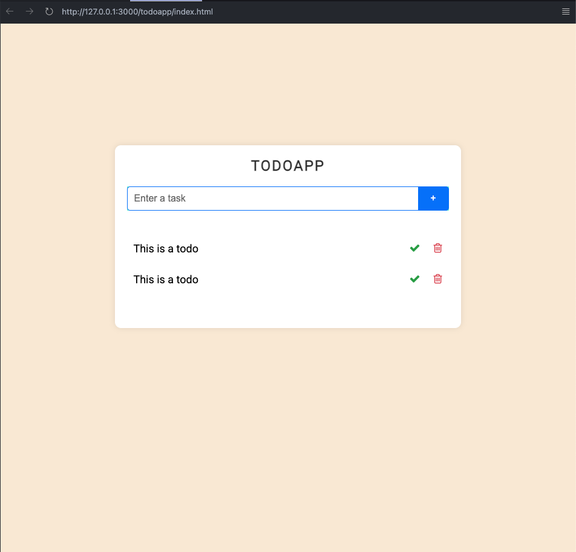

# Ukesoppgave 01

## Todoapp

### 1. Opprett et npm prosjekt

```node
$ npm init -y
```

output:

```node
Wrote to /Volumes/develop/gokstad/FUE2426/forelesninger/uke01/todoapp/package.json:
{
    "name": "todoapp",
    "version": "1.0.0",
    "description": "",
    "main": "index.js",
    "scripts": {
        "test": "echo \"Error: no test specified\" && exit 1"
    },
    "keywords": [],
    "author": "Abebe Bediye",
    "license": "MIT"
}
```

Filen **package.json** blir opprettet med innholdet i **output** over. Dette er konfigurasjons filen for prosjektet vårt, som vi skal oppdatere.

---

### 2. Oppdater **package.json** ved å legge til **type** og endre kjøre kommandoene i **scripts**

```diff
{
    "name": "todoapp",
    "version": "1.0.0",
    "description": "",
    "main": "index.js",
+   "type": "module",
    "scripts": {
-       "test": "echo \"Error: no test specified\" && exit 1"
+       "test": "jest",
+       "dev": "nodemon"
    },
    "keywords": [],
    "author": "Abebe Bediye",
    "license": "MIT"
}
```

- **type: module** forteller node at vi vil bruke modulbasert (ES6) syntax (eks: **import** isteden for **require**)
- **scripts**: kommandoer som vi kan kjøre med **npm run [kommando]**

---

### 3. Innstaller nodemon og jest

```node
$ npm install --save-dev jest nodemon
eller
$ npm install -D jest nodemon
```

Node vil oppdatere **package.json** med et nytt felt **devDependecies** og installere koden for de pakkene i **node_modules** mappen. Node vil også opprette en **package-lock.json** fil som du ikke trenger å bry deg om men den innholder informasjon om hvilke versjoner som skal installeres.

Les mer om **dependecies/devDependecies** i [dokumentasjonen](https://docs.npmjs.com/specifying-dependencies-and-devdependencies-in-a-package-json-file) på npm sine sider.

```diff
{
    "name": "todoapp",
    "version": "1.0.0",
    "description": "",
    "main": "index.js",
    "type": "module",
    "scripts": {
        "test": "jest",
        "dev": "nodemon"
    },
    "keywords": [],
    "author": "Abebe Bediye",
    "license": "MIT",
+   "devDependencies": {
+       "jest": "^29.7.0",
+       "nodemon": "^3.1.9"
+   }
}
```

---

### 4. Kopier HTML og CSS filene og opprett js start fil

Gå til [demo prosjeket](https://github.com/gokstadakademiet/emne4-jsapi/tree/main/uke01/todoapp) og kopier innholodet fra **index.html** og **style.css** inn i din egen **index.html** og **style.css** i rot mappen av prosjektet ditt.
Vi skal ikke bruke mye tid på HTML og css så dere får denne satt opp av meg. Ved å kjøre applikasjonen så skal den se ut som nedenfor. Resten av ukes oppgaven vil handle om å koble sammen denne applikasjonen med javascript og implementere funksjonalitet.



### 5. Implementer funksjonalitet for å legge til nye oppgaver i listen over oppgaver

Når brukeren skriver inn en oppgave i tekstfeltet og trykker på den blå **+** knappen skal teksten bli lagt til en liste over oppgaver. Denne listen skal gjenspeiles i listen over oppgaver under teksteltet. Skriv tester for å sikre funksjonaliteten.

### 6. Implementer funksjonalitet for å slette/fjerne oppgaver

Når brukeren trykker på en søppelbøtte knapp skal den oppgaven på den linjen bli fjernet fra listen over oppgaver. Skriv tester for å sikre funksjonaliteten.

### 7. Implementer funkjsonalitet for å gjennpomføre en oppgave

Når en bruker trykker på en grønn hake knapp skal den oppgaven på den linjen bli markert som gjennomført og flyttes nedenfor alle ikke gjennomførte oppgaver. Skriv tester for å sikre funksjonaliteten.

### 8. [BONUS] Implementer funksjonalitet for å legge til eller endre tidsfrist på ikke gjennomførte oppgaver

- Legg til en knapp som git brukeren mulighet til å legge til en tidsfrist for når oppgaven skal være gjennomført.
- Listen av oppgaver skal sorteres etter frist hvor første frist har øverst prioritet.
- Oppgaver med utløpte frister skal fremheves med rød varsling om at fristen har utløpt.
- Oppgaver som har frist i dag skal fremheves med gul varsling om at fristen utløper snart.

### 9. [BONUS] Implementer filtrering av listen

Legg til filtrering av listen slik at brukeren kan velge å kun vise,

- **Aktive**: Oppgaver som ikke er gjennomført enda.
- **Ferdig**: Oppgaver som er gjennomført
- **Utløpte**: oppgaver som har utløpt sine frist
- **Alle**: Alle oppgaver.
